# Relatório — Detecção de Bordas: Canny Clássico × Canny Modificado Gabor–Di Zenzo

**Disciplina:** Introdução ao Processamento Digital de Imagens — 2026.1
**Trabalho Prático** (conforme "Especificação do Trabalho Prático.pdf")

> **Nota de escopo:** este relatório em Markdown documenta e discute os
> experimentos obrigatórios (Seção 4 da especificação). O item 5 da
> especificação (entregáveis formais: pacote, relatório impresso/PDF,
> e-mail de equipe, apresentação) foi desconsiderado por instrução.

---

## 1. Introdução

O detector de Canny tradicional opera de forma **escalar**: converte a
imagem RGB para tons de cinza (Y = 0.299R + 0.587G + 0.114B) antes de
calcular gradientes. Esse achatamento linear é uma projeção de um espaço
3-D (cor) em 1-D (luminância): pares de cores distintas que caem no mesmo
Y tornam-se indistinguíveis, e as **bordas cromáticas** entre elas
desaparecem antes mesmo de qualquer gradiente ser calculado.

O **Canny Modificado Gabor–Di Zenzo** implementado aqui ataca o problema
em duas frentes:

1. **Filtros de Gabor** substituem o operador de Sobel: um banco de
   máscaras orientadas, sintonizadas em frequência espacial (λ) e escala
   (σ), captura transições de intensidade por direção.
2. **Fusão vetorial (estilo Di Zenzo):** cada máscara é aplicada aos
   canais R, G e B separadamente e as respostas são combinadas pela norma
   Euclidiana **no domínio das derivadas** — depois de derivar, não antes.
   Bordas visíveis em qualquer canal (ou em combinações deles)
   sobrevivem à fusão.

Os dois detectores foram implementados **do zero** (sem `cv2.Canny`,
`cv2.filter2D`, `cv2.getGaborKernel` ou equivalentes) e comparados sobre
as seis imagens de teste fornecidas.

## 2. Materiais e Métodos

### 2.1 Ferramentas e restrições respeitadas

- **Python 3.12 + NumPy** — exclusivamente álgebra de matrizes e laços;
  nenhuma função pronta de processamento de imagem.
- **Pillow** — somente abrir/salvar imagens e desenhar rótulos/retângulos
  nos painéis deste relatório.
- **matplotlib** — somente o gráfico de perfil 1-D da Seção 5.3.

Imagens RGBA com transparência real (FCBarcelona.png) foram compostas
sobre fundo branco; canal alfa totalmente opaco (Zebra.png) foi descartado.

### 2.2 Módulo A — Filtragem espacial genérica ([src/filtragem.py](src/filtragem.py))

Correlação bidimensional espacial própria, com a definição direta

    saida(i,j) = Σ_u Σ_v K(u,v) · I(i+u−ph, j+v−pw)

implementada por soma deslocada vetorizada (apenas operações elemento a
elemento do NumPy), para imagens (H,W) ou (H,W,C). Tratamento de borda
por **replicação** do pixel da margem (evita bordas artificiais no
contorno da imagem). A função foi validada contra uma implementação de
referência com laços explícitos (38 testes em
[testes/testes_sanidade.py](testes/testes_sanidade.py)).

Filtros estáticos são lidos de arquivos externos, como exige a
especificação: Sobel X/Y em `.txt` ([config/sobel_x.txt](config/sobel_x.txt),
[config/sobel_y.txt](config/sobel_y.txt)) e Gaussiana 5×5 (σ=1) em `.json`
com normalização automática ([config/gaussiana_5x5.json](config/gaussiana_5x5.json)).

### 2.3 Módulo B — Banco de Gabor paramétrico ([src/gabor.py](src/gabor.py))

As máscaras são geradas dinamicamente a partir de um arquivo JSON
([config/gabor_banco_padrao.json](config/gabor_banco_padrao.json)) com os
parâmetros da especificação — `tamanho_mascara`, `sigma`, `lambda`,
`gamma`, `psi`, `orientacoes_graus` (aceitos com ou sem acentos/maiúsculas):

    x' =  x·cosθ + y·sinθ          y' = −x·sinθ + y·cosθ
    g(x,y) = exp(−(x'² + γ²·y'²)/(2σ²)) · cos(2π·x'/λ + ψ)

**Convenção:** x = colunas (→ direita), y = linhas (→ **baixo**); θ é a
direção da **variação** (da portadora senoidal) — a borda detectada é
perpendicular a θ (θ = 0 ⇒ borda vertical). ψ em radianos.

Banco padrão: máscara 31×31, σ = 4, λ = 8, γ = 0.5, **ψ = −π/2** e
8 orientações [0, 22.5, …, 157.5]:

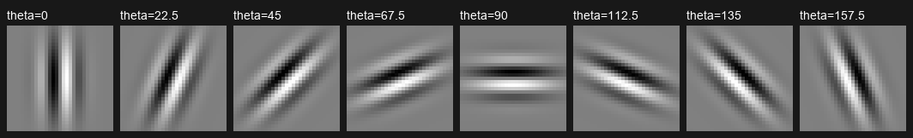

A escolha de ψ = −π/2 (portadora senoidal **ímpar**) é deliberada e está
justificada experimentalmente na Seção 4.5: filtros pares (ψ = 0) têm
resposta **nula no centro de um degrau** e produzem linhas duplas.

### 2.4 Módulo C — Canny Modificado ([src/canny_modificado.py](src/canny_modificado.py))

Fluxo por pixel, exatamente como na especificação:

1. **Filtragem por orientação:** para cada θ do banco, a máscara é
   aplicada a R, G e B separadamente via Módulo A.
2. **Fusão L2:** `Magn(i,j,θ) = √(Rθ² + Gθ² + Bθ²)`.
3. **Redução por máximo:** `Magnitude_Final = max_θ Magn`; a
   **Orientação Final** é o θ vencedor.
4. **NMS** guiado pela Orientação Final (vizinhos ortogonais à borda).
5. **Histerese** (fortes/fracos/suprimidos + conectividade).

A mesma rotina aceita imagem em tons de cinza — a fusão L2 de um único
canal vira |resposta| — o que dá o "**Gabor tradicional**" (escalar) usado
como contraste no Experimento 1.

### 2.5 Canny clássico ([src/canny_classico.py](src/canny_classico.py))

Y manual (0.299R+0.587G+0.114B) → Gaussiana 5×5 σ=1 (de arquivo, Módulo A)
→ Sobel X/Y (de arquivo, Módulo A) → magnitude L2 e direção `atan2(gy,gx)`
→ NMS → histerese. Mesmos NMS e histerese do pipeline modificado.

### 2.6 NMS com espessura de exatamente 1 pixel ([src/bordas.py](src/bordas.py))

A orientação é quantizada nos 4 eixos de vizinhança (0°, 45°, 90°, 135°)
e o pixel só sobrevive se for máximo em relação aos 2 vizinhos ao longo
da direção de variação. Em **platôs** de magnitude igual usa-se desempate
assimétrico (estritamente maior de um lado, maior-ou-igual do outro), o
que garante espessura final de exatamente 1 pixel mesmo em cristas com
topo plano — verificado nos testes unitários e na métrica de blocos 2×2
da Seção 5.2.

### 2.7 Histerese e justificativa dos limiares (Thigh e Tlow)

Notação: Thigh = T_high (limiar superior) e Tlow = T_low (limiar inferior),
como na especificação.
Classificação: **forte** (≥ T_high), **fraco** (≥ T_low), **suprimido**.
Pixels fracos só viram borda se conectados (8-vizinhança, busca em largura)
a um forte. Limiarização automática:

- **T_high = percentil 90 dos valores pós-NMS acima de um piso de ruído**.
  Após o NMS restam apenas picos de crista candidatos; manter os 10%
  mais fortes como sementes adapta o limiar ao conteúdo de cada imagem
  (T_high variou de 184 na Bear, clássico, a 7.951 na FCBarcelona,
  modificado — ver tabela da Seção 5.1).
- **T_low = 0.4·T_high** — razão T_high:T_low de 2,5:1, dentro da faixa
  2:1 a 3:1 recomendada por Canny: alto o bastante para não semear ruído,
  baixo o bastante para a histerese rastrear continuações fracas.
- **Piso absoluto de 0.5:** em dados 0–255, a menor borda real possível
  (degrau de 1 nível) gera magnitude Sobel ≥ 4; resíduos de arredondamento
  float ficam em ~10⁻⁴. Sem o piso, uma imagem **sem estrutura** teria
  percentis adaptados ao ruído de máquina e produziria bordas espúrias —
  exatamente o que aconteceria na GrayAndMagenta em tons de cinza, cuja
  magnitude máxima é 7.6×10⁻⁶ (Seção 5.3). Com o piso, o caso "nada a
  detectar" devolve corretamente zero bordas.

### 2.8 Exibição (Seção 3 da especificação)

Máscaras e mapas têm valores negativos e/ou ≫ 255. Para **todas** as
visualizações deste relatório aplicou-se **expansão de histograma** linear
para [0, 255] ([src/visualizacao.py](src/visualizacao.py)), apenas para
exibição. Atenção: a expansão é individual por mapa — brilho **não** é
comparável entre painéis; os valores reais (máximos) estão nos rótulos e
nos logs JSON.

## 3. Roteiro experimental

| Experimento | Varreduras | Saídas |
|---|---|---|
| 1 — Sensibilidade paramétrica | λ ∈ {4, 8, 16} (σ=4, máscara 31); σ ∈ {2, 4, 12} (λ=8, máscaras 13/31/73); ψ ∈ {0, −π/2}; γ ∈ {0.25, 0.5, 1.0}; métodos escalar × vetorial; 6 imagens | [resultados/experimento1/](resultados/experimento1/) (60 mapas + painéis), [log JSON](resultados/experimento1/log_experimento1.json) |
| 2 — Afinamento e histerese | pipeline completo clássico × modificado (banco padrão), 6 imagens | [resultados/experimento2/](resultados/experimento2/) (painéis, zooms 8×), [log JSON](resultados/experimento2/log_experimento2.json) |

Cada configuração de banco usada nas varreduras foi **escrita em
[config/experimentos/](config/experimentos/) e recarregada via Módulo B**,
exercitando o caminho completo arquivo-JSON → máscaras dinâmicas.

## 4. Experimento 1 — Sensibilidade paramétrica do Gabor

### 4.1 Efeito de λ (comprimento de onda): alta × baixa frequência

Máscaras θ=0 das três configurações (note o número de oscilações sob a
mesma envoltória):

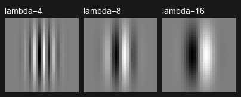

Caso ilustrativo — Zebra (método modificado), λ = 4 / 8 / 16:

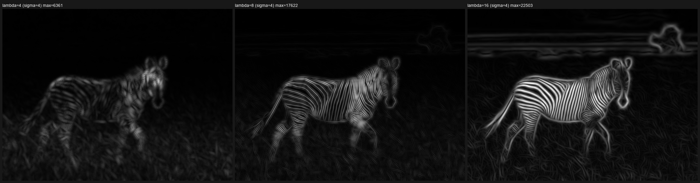

- **λ = 4 (alta frequência):** o filtro sintoniza texturas finas — capim
  e o detalhe fino da pelagem respondem; estruturas largas e suaves
  (nuvens, contorno do corpo) quase desaparecem.
- **λ = 8:** as listras da zebra (período compatível) atingem resposta
  máxima nítida; equilíbrio entre textura e contorno.
- **λ = 16 (baixa frequência):** os **macrocontornos** dominam — silhueta
  do animal, linha do horizonte e nuvens acendem; as listras finas
  começam a se fundir, e as bordas ficam mais espessas (pior localização).

O mesmo padrão se repete nas demais imagens (painéis
`painel_lambda_*.png` em cada pasta): na PlacaMercosul, λ=4 realça o
serrilhado e micro-texto, λ=16 realça a moldura da placa e o contorno do
carro; na FCBarcelona, λ=16 privilegia o contorno do escudo sobre as
listras internas. A magnitude máxima cresce sistematicamente com λ
(ex.: Zebra modificado: 6.361 → 17.622 → 22.503), pois com menos
oscilações sob a envoltória há menos cancelamento ao integrar um degrau.

### 4.2 Efeito de σ (escala) e a pergunta do σ excessivo

Máscaras θ=0 (mesmo λ=8; σ = 2/4/12, máscaras 13/31/73):

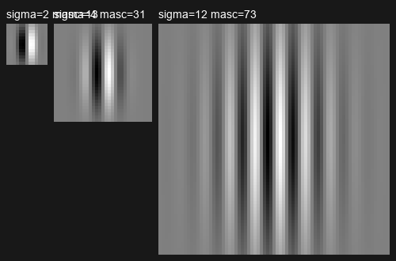

Zebra (textura marcada) e Bear (pelagem fina), método modificado:

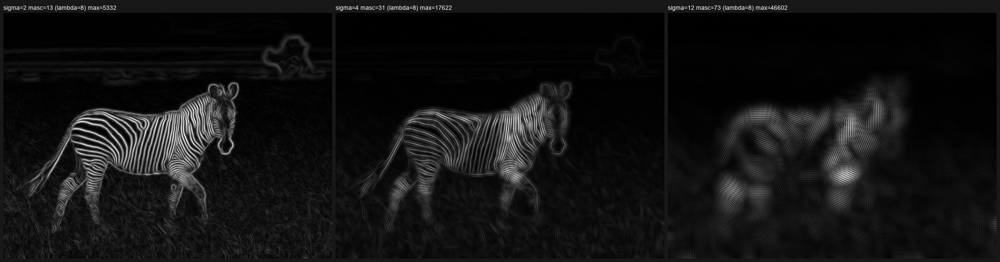


- **σ = 2:** suporte pequeno → excelente localização; tudo responde,
  inclusive ruído fino.
- **σ = 4:** compromisso do banco padrão.
- **σ = 12 (excessivo, máscara 73×73):** *o que acontece?* O suporte do
  filtro (±36 px) engloba **vários períodos da textura**. As respostas de
  bordas vizinhas com sinais opostos se sobrepõem dentro da envoltória e
  interferem; o mapa degenera em **manchas borradas de baixa frequência**:
  as listras da zebra se fundem em blobs, a pelagem do urso vira um halo
  difuso, e os máximos se **deslocam** das posições reais das bordas
  (perda de localização). Um NMS sobre esse mapa produz cristas largas e
  espúrias. É a manifestação prática do compromisso incerteza
  espacial-frequencial: σ grande melhora a seletividade em frequência ao
  custo da localização espacial — fatal em cenário texturizado.

### 4.3 Gabor tradicional (escalar) × Modificado (vetorial)

Para cada imagem e configuração, o mesmo banco foi aplicado de duas
formas: sobre Y (escalar) e sobre R,G,B com fusão L2 (vetorial). Painel
da GrayAndMagenta na configuração padrão:

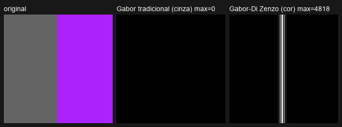

Resultado numérico para a GrayAndMagenta (máxima magnitude por
configuração, do [log](resultados/experimento1/log_experimento1.json)):

| Configuração | Escalar (Y) | Vetorial (RGB) |
|---|---|---|
| λ=4, σ=4 | **0.0** | 1.766 |
| λ=8, σ=4 | **0.0** | 4.818 |
| λ=16, σ=4 | **0.0** | 10.025 |
| λ=8, σ=2 | **0.0** | 2.293 |
| λ=8, σ=12 | **0.0** | 11.639 |

O escalar é **estruturalmente cego** à borda — nenhum parâmetro o salva,
porque a informação já foi destruída na projeção para Y (discussão
completa na Seção 5.3). Nas imagens naturais a diferença é mais sutil
(canais correlacionados), mas o vetorial responde mais forte exatamente
onde a transição é cromática (painéis `painel_tradicional_vs_modificado.png`
de cada imagem).

### 4.4 Efeito de γ (elipsicidade) — FCBarcelona

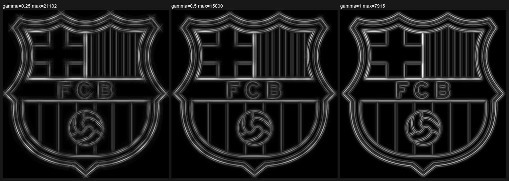

γ controla a razão de aspecto da envoltória (desvio ao longo da borda =
σ/γ). **γ = 0.25** alonga o filtro na direção da borda (±16 px): contornos
retos/longos são reforçados e ficam mais contínuos (máx 21.132), mas
cantos e curvas fechadas borram. **γ = 1.0** (isotrópico) localiza melhor
detalhes e curvas, com respostas mais fracas (máx 7.915) e mais
fragmentadas. γ = 0.5 é o meio-termo adotado.

### 4.5 Efeito de ψ (fase): por que o banco padrão usa ψ = −π/2

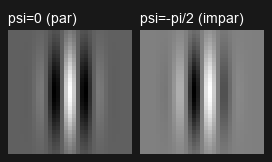
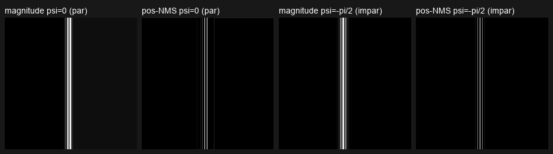

Sobre um **degrau** ideal: o filtro **par** (ψ=0, cossenoidal, simétrico)
tem resposta **nula exatamente no centro da borda** e dois picos
simétricos em ±λ/4 — visível no painel: a magnitude tem um vale escuro no
meio da faixa clara, e o NMS devolve **duas linhas paralelas** (linha
dupla). O filtro **ímpar** (ψ=−π/2, senoidal, anti-simétrico — e com soma
exatamente zero, sem resposta DC) tem pico **único no centro do degrau**;
o NMS devolve a linha central forte e dois lóbulos laterais fracos em
±λ/2, que a histerese elimina por não estarem conectados a sementes
fortes. Por isso o banco padrão usa ψ = −π/2: é o detector de degraus
correto para o pipeline de afinamento. (Mesmo comportamento na
VintageCar: `VintageCar/painel_psi.png`.)

## 5. Experimento 2 — Validação do afinamento (NMS) e da histerese

### 5.1 Limiarização: valores escolhidos e classificação

Limiarização automática (P90 pós-NMS + razão 0,4 + piso 0,5 — justificativa
na Seção 2.7). Valores efetivamente usados:

| Imagem | Método | T_low | T_high | Candidatos NMS | Fortes | Fracos | Borda final |
|---|---|---|---|---|---|---|---|
| Bear | modificado | 1.357,8 | 3.394,6 | 742.745 | 74.275 | 220.726 | 189.751 |
| Bear | clássico | 73,5 | 183,7 | 715.119 | 71.502 | 204.176 | 191.129 |
| FCBarcelona | modificado | 3.180,5 | 7.951,3 | 41.206 | 4.031 | 15.916 | 7.036 |
| FCBarcelona | clássico | 256,6 | 641,5 | 12.579 | 1.258 | 9.105 | 2.603 |
| GrayAndMagenta | modificado | 1.927,3 | 4.818,4 | 1.324 | 224 | 448 | **224** |
| GrayAndMagenta | clássico | ∞ | ∞ | 224¹ | 0 | 0 | **0** |
| PlacaMercosul | modificado | 1.810,3 | 4.525,8 | 111.751 | 11.170 | 15.720 | 18.619 |
| PlacaMercosul | clássico | 133,7 | 334,3 | 83.808 | 8.292 | 4.774 | 11.146 |
| VintageCar | modificado | 1.666,0 | 4.165,1 | 94.989 | 9.491 | 17.075 | 18.867 |
| VintageCar | clássico | 105,7 | 264,2 | 75.324 | 7.239 | 12.524 | 13.611 |
| Zebra | modificado | 1.409,0 | 3.522,4 | 122.627 | 12.263 | 20.390 | 18.633 |
| Zebra | clássico | 80,5 | 201,3 | 113.419 | 11.334 | 14.985 | 13.928 |

¹ "candidatos" de magnitude ~10⁻⁶ (ruído numérico), todos abaixo do piso →
limiares (∞, ∞) → zero bordas, comportamento correto para uma imagem cuja
luminância é constante.

A coluna "fracos" mostra a histerese trabalhando: na FCBarcelona, dos
15.916 fracos só ~3.000 entraram no resultado (os conectados a sementes);
na GrayAndMagenta, os 448 fracos (dois lóbulos laterais paralelos do
filtro ímpar) foram **todos** rejeitados por não tocarem a linha forte.
O trimapa fortes/fracos/suprimidos de cada imagem está em
`04_mod_classes.png` (branco/cinza/preto).

### 5.2 Afinamento: 1 pixel de largura, com zoom digital

Pipeline do modificado lado a lado (magnitude → pós-NMS → classes →
bordas finais) — exemplo PlacaMercosul:

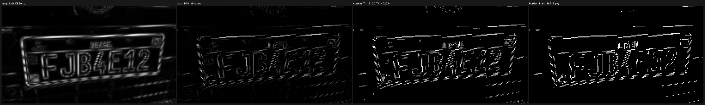

Zoom digital 8× (vizinho mais próximo) na janela de maior densidade de
bordas (marcada em `05b_mod_bordas_janela_zoom.png` de cada pasta).
GrayAndMagenta e PlacaMercosul:

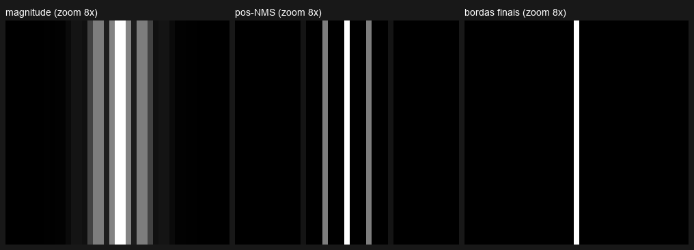
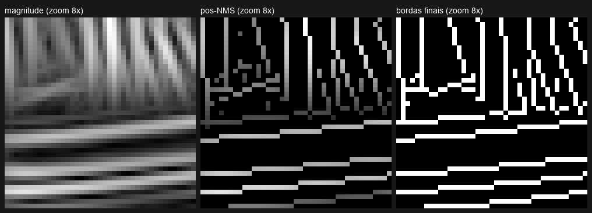

No zoom vê-se a magnitude como faixa larga, o pós-NMS reduzido a cristas
de **1 pixel** e as bordas finais limpas. Verificação quantitativa: fração
de blocos 2×2 completamente preenchidos (um mapa 1 px não deveria ter
nenhum, exceto junções):

| Imagem | Modificado | Clássico |
|---|---|---|
| Bear | 176 blocos (0,093% das bordas) | 904 (0,47%) |
| FCBarcelona | 3 (0,043%) | 0 (0%) |
| GrayAndMagenta | **0 (0%)** | 0 (—) |
| PlacaMercosul | 7 (0,038%) | 1 (0,009%) |
| VintageCar | 3 (0,016%) | 19 (0,14%) |
| Zebra | 50 (0,27%) | 43 (0,31%) |

Todos ≪ 1%: o afinamento é efetivamente de 1 pixel; os raros blocos
ocorrem em **junções** onde cristas de orientações diferentes se cruzam
(cada uma tem 1 px, mas o cruzamento forma um canto 2×2). Na
GrayAndMagenta a verificação é exata: 224 linhas × exatamente 1 pixel
por linha.

### 5.3 GrayAndMagenta.png em detalhe (discussão exigida pela especificação)

A imagem tem só duas cores: cinza **RGB (100,100,100)** e magenta
**RGB (172,34,251)**. Aplicando a fórmula da luminância:

    Y_cinza   = 0.299·100 + 0.587·100 + 0.114·100 = 100.0
    Y_magenta = 0.299·172 + 0.587·34  + 0.114·251 = 100.0

As duas cores são **exatamente isoluminantes**: após a conversão manual
para tons de cinza a imagem é uma constante (Y ≡ 100). Não há gradiente a
detectar — o Canny clássico não falha por má calibração, falha por
**impossibilidade matemática**: a informação da borda foi aniquilada pela
projeção linear antes de qualquer filtragem. O perfil da linha central
mostra isso com precisão:

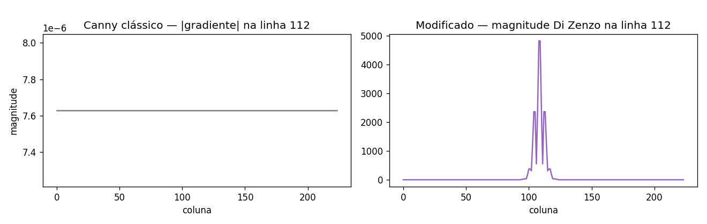

À esquerda, a "magnitude" do clássico é uma reta em **7,6×10⁻⁶** (ruído de
arredondamento float — note a escala 10⁻⁶); à direita, o modificado tem um
pico de **4.818** na coluna da borda (seis ordens de grandeza acima), com
os dois lóbulos laterais característicos do filtro ímpar em ±λ/2.
No domínio vetorial a transição é enorme: ΔRGB = (72, −66, 151), com
norma ≈ 180 — o filtro responde em R, G e B individualmente e a fusão L2
preserva tudo.

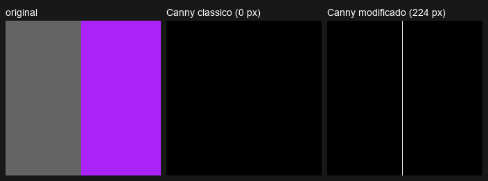

Resultado final: clássico **0 px** de borda; modificado: a linha vertical
completa, **224/224 linhas com exatamente 1 px de largura**, sem nenhum
falso positivo. Este é o caso-limite que motiva o trabalho: bordas
puramente cromáticas são invisíveis a qualquer pipeline escalar, por
melhor que sejam seus filtros.

### 5.4 Comparação Canny clássico × modificado nas demais imagens

**FCBarcelona** — o caso real mais revelador:

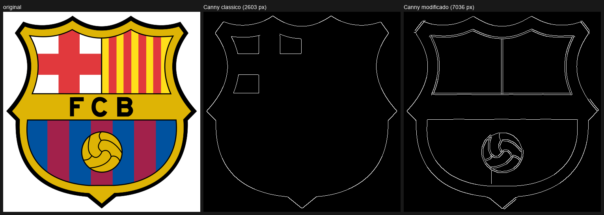

O clássico (2.603 px) recupera a silhueta do escudo (contraste enorme
contra o fundo branco) e fragmentos internos, mas **perde quase toda a
estrutura interna** — em particular as listras azul/grená da metade
inferior: medindo na própria imagem, o grená é RGB (162,33,75) → Y = 76,4
e o azul é RGB (0,82,159) → Y = 66,3. **ΔY ≈ 10** (4% da faixa), abaixo
dos limiares úteis — é uma versão "de mundo real" da GrayAndMagenta. No
espaço RGB a distância entre as mesmas cores é ≈ 189. O modificado
(7.036 px) recupera as listras, a divisão dos quartéis superiores, a
faixa "FCB" e a bola com costuras.

**Bear** (1920×1273, pelagem fina):


Cena dominada por textura: ambos os métodos devolvem ~190 mil px de
borda, majoritariamente pelos. As diferenças são de qualidade: o
modificado produz contornos externos mais contínuos (transição cromática
pelo-marrom/fundo) e menos blocos 2×2 (0,09% vs 0,47%). Cena assim expõe
o limite do limiar global por percentil: para extrair só macrocontornos
seria preciso subir o percentil ou λ (ver Seção 4.1).

**PlacaMercosul** — alvo de alta frequência (texto):

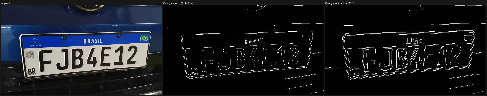

Ambos deixam os caracteres legíveis. O clássico dá traços mais finos e
econômicos (11.146 px); o modificado (18.619 px) resolve as **duas**
bordas de cada traço (contorno duplo — cada traço preto sobre branco tem
duas transições, separáveis com λ=8) e captura mais da faixa azul
superior ("BRASIL", bandeira), onde a transição azul/branco é também
cromática.

**VintageCar e Zebra:**

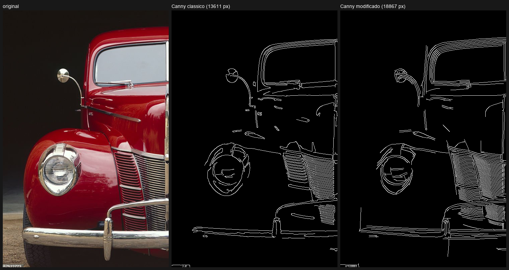
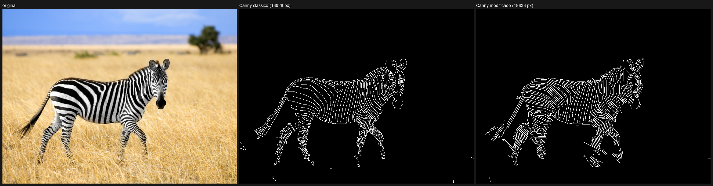

Na VintageCar o modificado segue melhor a lataria vermelha contra o fundo
escuro (transição com forte componente de matiz) e devolve contornos mais
contínuos no capô e nos frisos (18.867 vs 13.611 px; blocos 2×2: 0,016%
vs 0,14%). Na Zebra, listras pretas/brancas são o caso ideal do método
escalar (puro contraste de luminância) e os dois ficam próximos; o
modificado adiciona contornos do céu/nuvens e do gramado, onde há matiz.

**Custo computacional** (medido): o modificado custa ~50–100× o clássico
(Bear: 63,9 s vs 1,7 s) — 8 orientações × máscara 31×31 × 3 canais contra
1 Gaussiana 5×5 + 2 Sobéis 3×3 num único canal. É o preço da informação
vetorial + seletividade de orientação/frequência.

## 6. Problemas e dificuldades encontradas

1. **Limiar adaptativo enganado por ruído de máquina:** na primeira
   versão, a GrayAndMagenta em tons de cinza produzia 48 px de "borda"
   vindos de resíduos float de 10⁻⁵ — o percentil se adaptava ao ruído.
   Solução: piso absoluto de magnitude (0,5) na seleção automática
   (Seção 2.7). Caso instrutivo: limiar relativo sem âncora absoluta é
   frágil em imagens sem estrutura.
2. **Empate em platôs no NMS:** a regra clássica (≥ dos dois lados)
   mantém cristas de 2 px quando há topo plano. O desempate assimétrico
   resolve e foi coberto por teste unitário.
3. **Custo da correlação espacial pura:** a máscara 73×73 sobre a Bear
   custou 328 s (5,5 min) no método vetorial. Mitigações adotadas sem
   sair do domínio espacial: float32, buffer pré-alocado e pulo de
   coeficientes nulos. O Experimento 1 completo levou 18,2 min.
4. **Linhas duplas com ψ = 0:** descoberta documentada na Seção 4.5; o
   banco padrão passou a usar ψ = −π/2.
5. **Lóbulos laterais do filtro ímpar:** viram linhas paralelas fracas no
   NMS; com T_low = 0,4·T_high ficam abaixo do limiar fraco ou
   desconectados e a histerese os elimina (verificado na GrayAndMagenta).
6. **Limitações conhecidas (não corrigidas, por desenho):** quantização
   da orientação em 4 eixos (as orientações 22,5°/67,5°/112,5°/157,5° do
   banco são atribuídas ao eixo diagonal mais próximo no NMS); limiar
   global único por imagem (cenas com textura densa, como a Bear, mantêm
   muita borda de textura); a expansão de histograma individual impede
   comparação de brilho entre painéis (valores reais nos logs).

## 7. Conclusão

Todos os módulos exigidos foram implementados do zero e validados
(38 testes de sanidade + teste end-to-end). Os experimentos sustentam as
duas teses do trabalho:

1. **Parâmetros do Gabor governam o que é "borda":** λ seleciona a banda
   de frequência (texturas finas × macrocontornos), σ controla o
   compromisso localização × seletividade — e, excessivo, destrói a
   localização em cenas texturizadas (Zebra/Bear com σ=12) —, γ troca
   continuidade de contornos retos por sensibilidade a curvas, e ψ
   decide entre detector de linhas (par, linha dupla em degraus) e
   detector de degraus (ímpar, linha única).
2. **Processar cor vetorialmente preserva bordas que o pipeline escalar
   destrói:** de forma absoluta no caso isoluminante construído
   (GrayAndMagenta: 0 px × 224 px com 1 px de largura) e de forma
   mensurável em imagem real (FCBarcelona: listras azul/grená com
   ΔY ≈ 10, invisíveis ao clássico e recuperadas pelo modificado).

O custo é computacional (~50–100×) e de parametrização (5 parâmetros +
orientações contra quase nenhum no Sobel). Para imagens em que a
luminância já carrega as bordas (Zebra), o clássico continua competitivo
e muito mais barato.

---

### Apêndice A — Reprodução

```powershell
pip install -r requirements.txt
python testes\testes_sanidade.py     # 38 testes unitários
python experimentos\experimento1.py  # ~18 min
python experimentos\experimento2.py  # ~2 min
python testes\teste_e2e.py           # validação de ponta a ponta
```

### Apêndice B — Inventário de saídas

- `resultados/experimento1/<imagem>/` — mapas de magnitude por
  configuração/método, painéis de varredura (λ, σ), `painel_psi.png`
  (GrayAndMagenta, VintageCar), `painel_gamma.png` (FCBarcelona),
  `painel_tradicional_vs_modificado.png`.
- `resultados/experimento1/kernels_*.png` — máscaras do banco padrão e
  das varreduras (expansão de histograma, zoom 4×).
- `resultados/experimento2/<imagem>/` — `01…09` (todas as etapas dos dois
  pipelines), painéis `painel_modificado/classico/comparacao.png`, zooms
  8× (`painel_zoom_mod/cla.png`), janela do zoom marcada (`05b…`), e
  `perfil_linha_central.png` (GrayAndMagenta).
- `resultados/experimento{1,2}/log_experimento{1,2}.json` — todos os
  números citados (tempos, limiares, contagens, máximos).
